# Kafka Basics Homework

## Overview

This example shows how KSQL can be used to process a stream of click data, aggregate and filter it, and join to information about the users.
Visualisation of the results is provided by Grafana, on top of data streamed to Elasticsearch. 

## Documentation

You can find the documentation for running this example and its accompanying tutorial at [https://docs.confluent.io/platform/current/tutorials/examples/clickstream/docs/index.html](https://docs.confluent.io/platform/current/tutorials/examples/clickstream/docs/index.html?utm_source=github&utm_medium=demo&utm_campaign=ch.examples_type.community_content.clickstream)

___
_The next part of this readme is written by me, Jakub Porębski._
___

## Video
I've posted a short video (~4 minutes) documenting whole process. It is available on YouTube: [click here](https://youtu.be/evNGv9iqdkQ).

## Going through the steps

_Note:_ In order to sucessfully start `elasticsearch` container, you may need to run: `sudo sysctl -w vm.max_map_count=262144`.

* Let's run first commands, ie: `git checkout` and `docker run`:

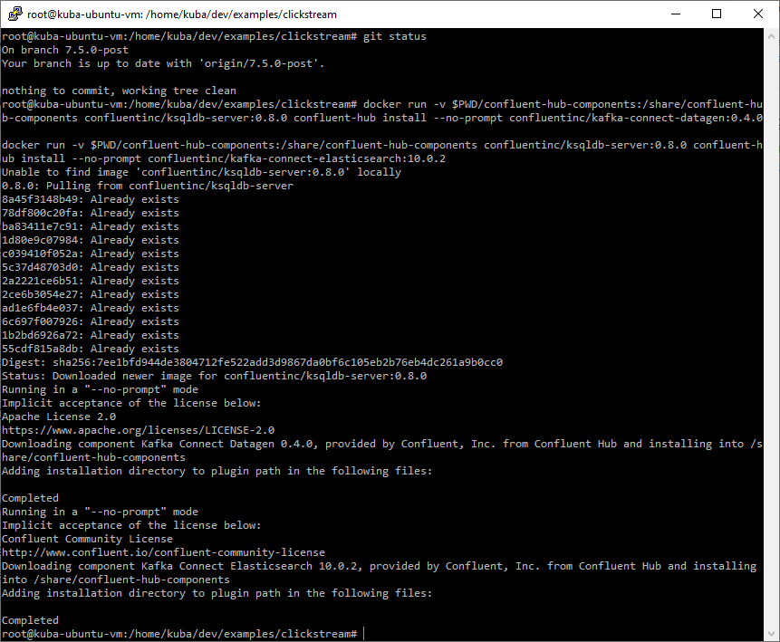

* Then we can run `docker-compose up -d` to create and run an entire environment for this tutorial:

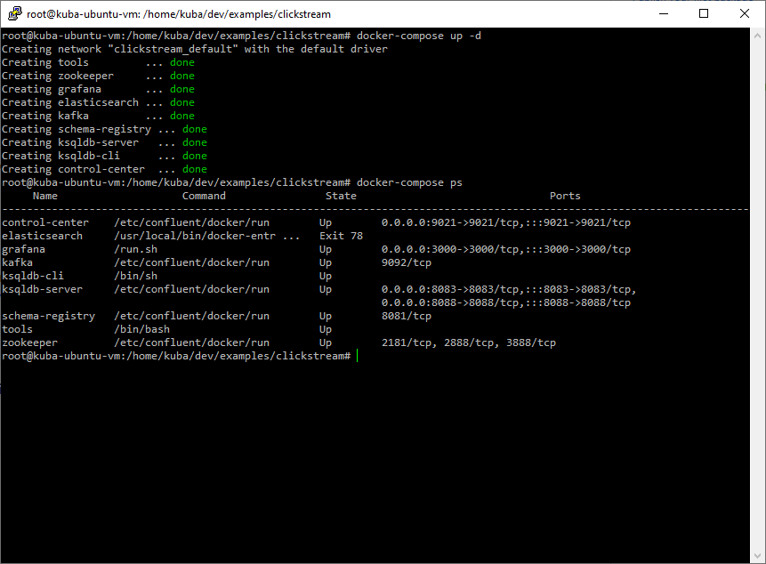

* Now, we can create clickstream connectors:

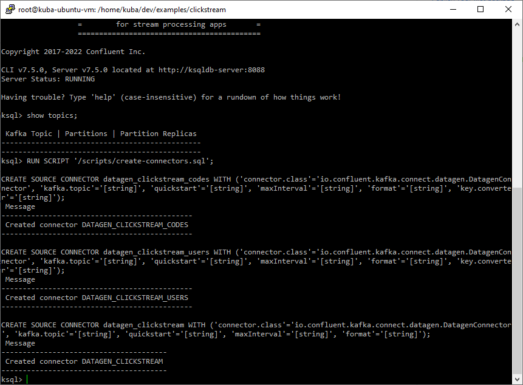

* Were they created? Let's check by printing: 

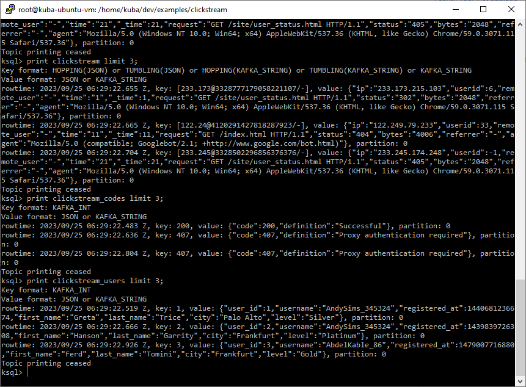

* We can also check them on Confluent Dashboard:

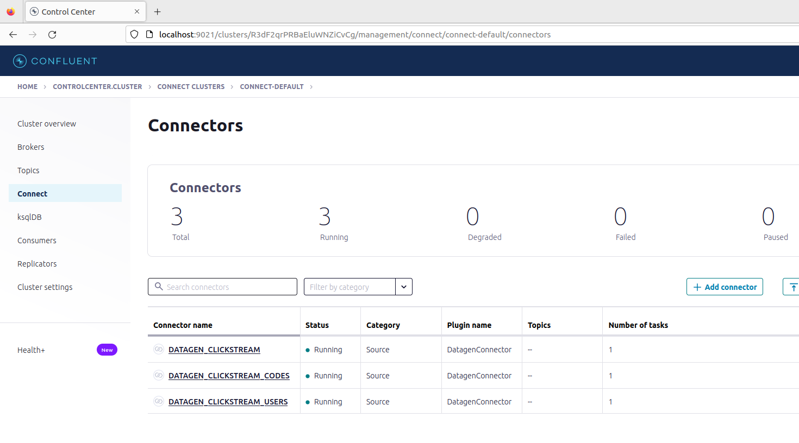

* We can also read from them using a ksql tool available in Confluent Dashboard:

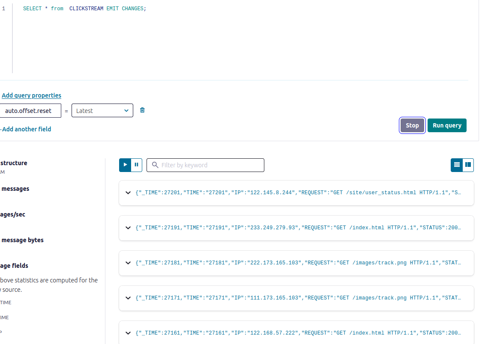

* Basics foundations seems to be created successfully.
* Next, we have to create ksqldb streams based on kafka topics we created previously. So, we run `/scripts/statements.sql`:

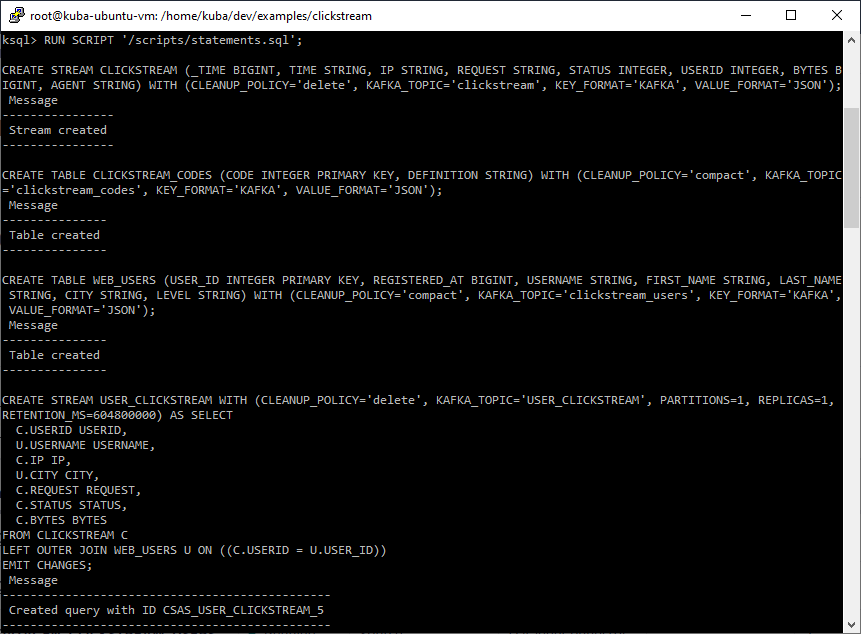

* How it looks like in Confluent Dashboard?

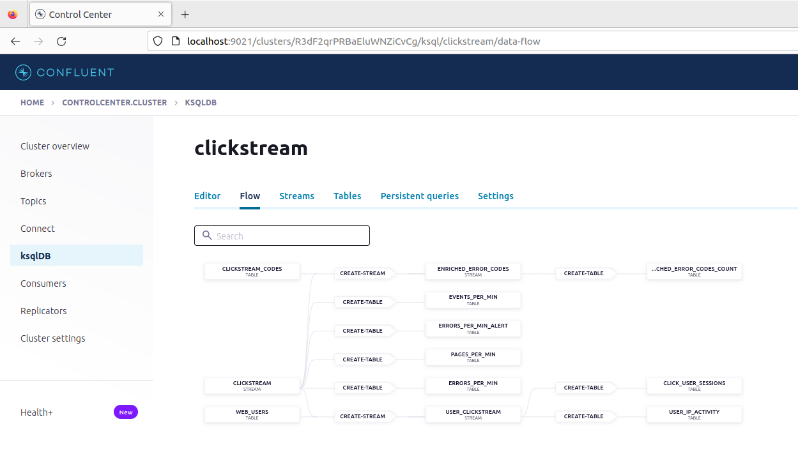

* So, it's good too. 
* Now it's time to execute scripts for setting up Elasticsearch and Grafana :

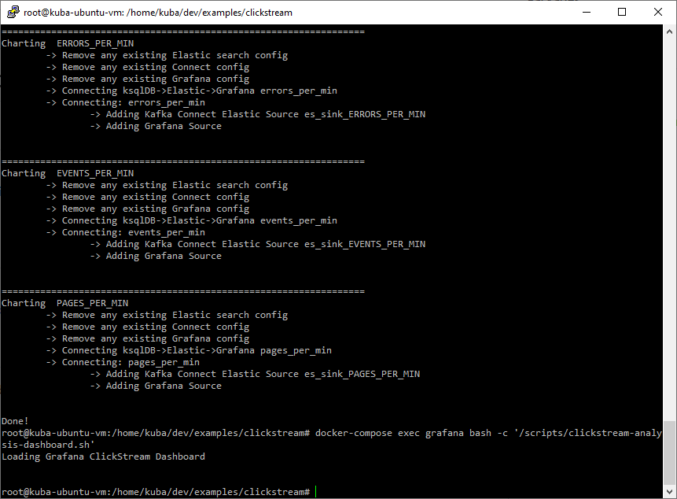

* Now, let's see Grafana Dashboard:

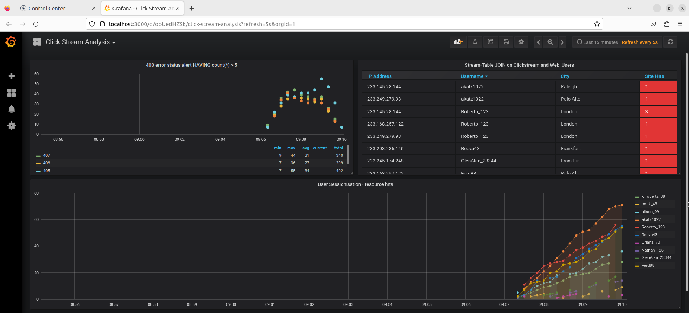

* Again, everything was done correctly so far. There are also a few more connectors visible:

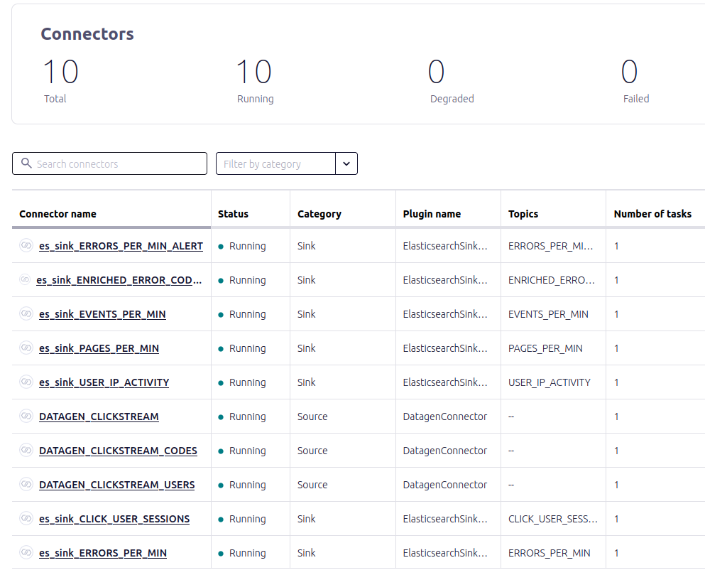

* The next part of tutorial is to sessionize the data. We shall run the script and wait a few minutes for data to be generated in apriopriate way. After that we can see what's going on:

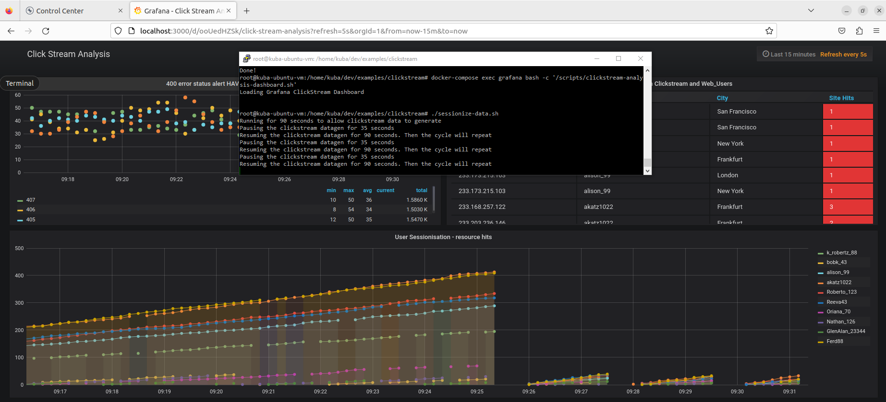

* All done!
* We can tear down the entire tutorial environment by issuing `docker-compose down`. 

